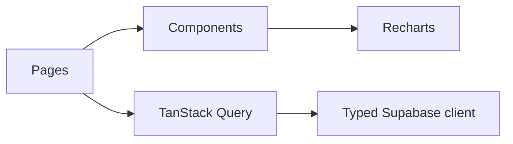
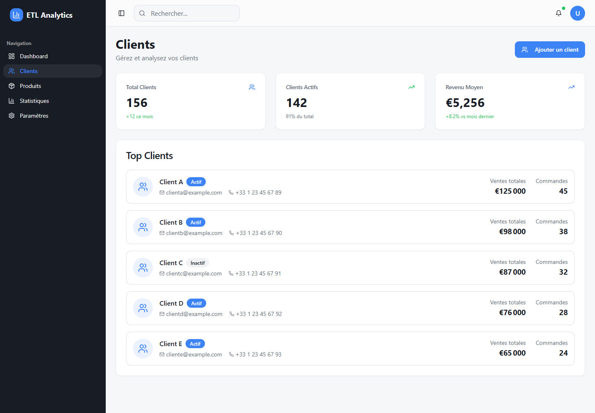
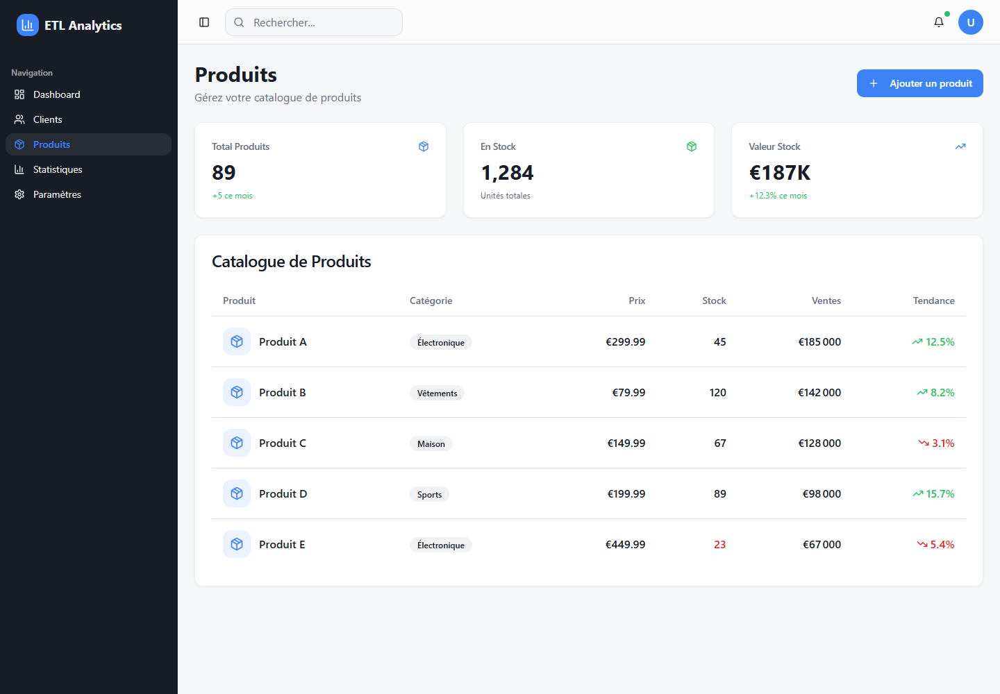

# Sales Analytics Dashboard

[](https://github.com/KhaledZouari/sales-analytics-dashboard/actions/workflows/ci.yml)
[](LICENSE)

An interactive web dashboard for monitoring sales performance, customers,
products, and business KPIs.

[View the live demo](https://khaledzouari.github.io/sales-analytics-dashboard/)

## Features

- Revenue and performance KPI cards
- Sales trends and category breakdowns
- Customer and product analysis
- Interactive charts, filters, and responsive layouts
- Typed data access prepared for Supabase integration

## Stack

React 18, TypeScript, Vite, Supabase, TanStack Query, Recharts, shadcn/ui,
Tailwind CSS, ESLint, and Vitest.

## Architecture



## Local setup

Prerequisites: Node.js 20 and npm.

```bash
git clone https://github.com/KhaledZouari/sales-analytics-dashboard.git
cd sales-analytics-dashboard
cp .env.example .env
npm ci
npm run dev
```

On PowerShell, replace `cp` with `Copy-Item`.

## Configuration

| Variable | Purpose |
| --- | --- |
| `VITE_SUPABASE_URL` | Public Supabase project URL |
| `VITE_SUPABASE_ANON_KEY` | Public anonymous client key |
| `VITE_SUPABASE_PROJECT_ID` | Public Supabase project identifier |

Never expose a Supabase `service_role` key through a Vite variable.

## Verification

```bash
npm run lint
npm test
npm run build
```

Client and product pages use bundled fictional examples. The main overview
requires a separate Express API at `http://localhost:5000`, which is not
included in this repository. Supabase integration is scaffolding only.

## Business context and engineering approach

### Sales-analysis interface prototype

The React interface organizes KPI cards, chart components, client summaries and
a product table. The available client and product pages use bundled fictional
examples; the main overview calls an external Express API at localhost:5000.

Reusable typed UI components and Recharts separate presentation from chart
rendering. A typed Supabase client exists as integration scaffolding, but the
displayed client and product examples are not sourced from Supabase.

## Application screenshots

Captured from the running application on 3 October 2026.

### Client analysis prototype



Bundled fictional client cards and illustrative KPI values.

### Product catalog prototype



Bundled fictional products, stock and sales presentation.

## Evidence and current scope

The public repository does not include the Express API required by the overview.
Product distribution is not populated by that page, the tax-rate value is hard-
coded and the advanced-statistics page is a placeholder. This is a UI prototype
rather than a verified end-to-end analytics pipeline.

## License

Distributed under the MIT License. See [LICENSE](LICENSE).
