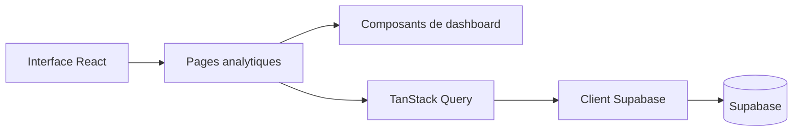

# Stats Weaver Dashboard

Tableau de bord web pour consulter des indicateurs commerciaux, suivre leur
évolution et explorer les clients et produits associés.

## Fonctionnalités

- Vue synthétique d’indicateurs clés avec filtre par période.
- Graphiques d’évolution des ventes, de répartition des produits et des
  principaux clients.
- Pages dédiées au tableau de bord, aux statistiques, aux clients, aux
  produits et aux paramètres.
- Accès aux données via un client Supabase typé.

## Stack

React 18, TypeScript, Vite, Supabase, TanStack Query, Recharts, shadcn/ui,
Tailwind CSS, ESLint et Vitest.

## Architecture



## Installation

Prérequis : Node.js 20 et npm.

```bash
git clone https://github.com/KhaledZouari/stats-weaver-dash.git
cd stats-weaver-dash
cp .env.example .env
npm ci
npm run dev
```

Sous PowerShell, utiliser `Copy-Item .env.example .env` à la place de `cp`.

## Configuration

| Variable | Description |
| --- | --- |
| `VITE_SUPABASE_PROJECT_ID` | Identifiant public du projet Supabase. |
| `VITE_SUPABASE_PUBLISHABLE_KEY` | Clé client publiable Supabase. |
| `VITE_SUPABASE_URL` | URL publique du projet Supabase. |

Ne jamais placer de clé `service_role` dans une variable exposée par Vite.

## Tests et qualité

```bash
npm run lint
npm test
npm run build
```

La CI exécute ces commandes sur chaque pull request et chaque push sur `main`.

## API et données

L’application utilise le client généré dans `src/integrations/supabase`. Le
schéma typé constitue le contrat entre les requêtes React et Supabase.

## Captures d’écran

Les futures captures sont regroupées dans `docs/screenshots/`.

## Choix techniques

- TanStack Query gère le cycle de vie des données distantes.
- Recharts fournit les visualisations du dashboard.
- Le client Supabase typé réduit les écarts entre schéma et interface.

## Pistes d’amélioration

- Vérifier et documenter les politiques Row Level Security Supabase.
- Découper le bundle principal par route avec des imports dynamiques.
- Étendre les tests aux transformations des données analytiques.

## Licence

Ce projet est distribué sous licence MIT. Voir [LICENSE](LICENSE).
