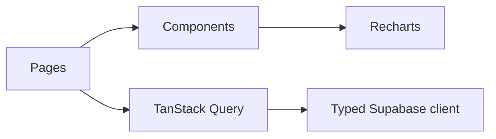

# Sales Analytics Dashboard

[](https://github.com/KhaledZouari/sales-analytics-dashboard/actions/workflows/ci.yml)
[](LICENSE)

An interactive web dashboard for monitoring sales performance, customers,
products, and business KPIs.

[View the live demo](https://khaledzouari.github.io/sales-analytics-dashboard/)

## Features

- Revenue and performance KPI cards
- Sales trends and category breakdowns
- Customer and product analysis
- Interactive charts, filters, and responsive layouts
- Typed data access prepared for Supabase integration

## Stack

React 18, TypeScript, Vite, Supabase, TanStack Query, Recharts, shadcn/ui,
Tailwind CSS, ESLint, and Vitest.

## Architecture



## Local setup

Prerequisites: Node.js 20 and npm.

```bash
git clone https://github.com/KhaledZouari/sales-analytics-dashboard.git
cd sales-analytics-dashboard
cp .env.example .env
npm ci
npm run dev
```

On PowerShell, replace `cp` with `Copy-Item`.

## Configuration

| Variable | Purpose |
| --- | --- |
| `VITE_SUPABASE_URL` | Public Supabase project URL |
| `VITE_SUPABASE_ANON_KEY` | Public anonymous client key |
| `VITE_SUPABASE_PROJECT_ID` | Public Supabase project identifier |

Never expose a Supabase `service_role` key through a Vite variable.

## Verification

```bash
npm run lint
npm test
npm run build
```

The public demo currently uses datasets bundled with the pages. The typed
Supabase client prepares a future persistent data source without exposing
private credentials.

## License

Distributed under the MIT License. See [LICENSE](LICENSE).

